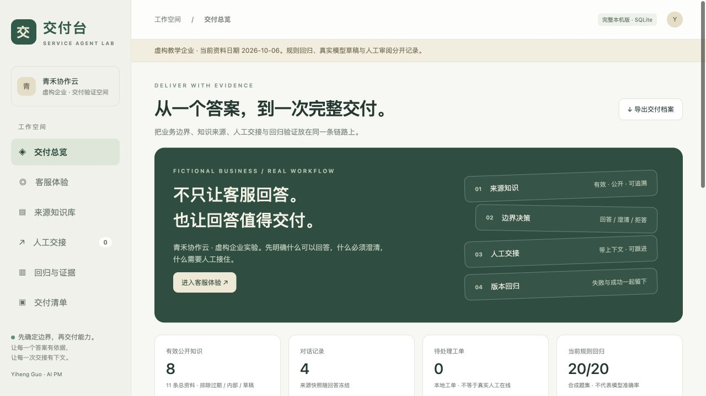

# 交付台 · 企业客服 Agent 交付实验室

**从一个答案，到一次可以复核的交付。**

一个可运行的完整作品，把 To B 需求边界、来源知识库、客服回答、拒答与澄清、人工工单、知识发布门禁、版本回归和交付清单串在一起。



## 先体验

- 公开浏览器体验：https://yiheng-guo.github.io/customer-agent-delivery-lab/ （部署状态以 Pages / Actions 为准）
- 完整本机版：`http://127.0.0.1:4340`
- [产品设计与验收](docs/PRODUCT.md)
- [规则回归：逐题原始结果](docs/reports/rule-regression.md)
- [两次真实模型调用与限制](docs/reports/model-smoke.md)
- [启动、交接与继续开发](docs/HANDOVER.md)
- [实际验证与未测边界](docs/VALIDATION.md) · [版本记录](CHANGELOG.md)

**虚构企业，真实操作。** 青禾协作云、业务规则、内部资料和测试问题均为本项目编写的合成素材，没有客户授权或业务效果证明。没有使用奎达客户资料、团队海龟汤或一炷源码、欧莱雅黑客松私有材料。

公开版使用当前浏览器 localStorage，支持规则回答、人工工单模拟、回归与导出；不调用模型，知识只读。清除浏览器数据会丢失，请导出备份。完整本机版使用 Node 24 + SQLite，支持知识编辑、版本回退、真实 Codex 草稿、人工语义审阅；不提供多人鉴权，默认只绑定本机。

## 运行

Node.js 24+，无第三方运行依赖。

```sh
git clone https://github.com/Yiheng-guo/customer-agent-delivery-lab.git
cd customer-agent-delivery-lab
npm ci
npm start
```

打开 `http://127.0.0.1:4340`。规则模式不调用模型。可用 `PORT` 更换端口，`LAB_DATA_DIR` 指定新的本机档案目录。

真实模型使用已有 Codex CLI 登录：

```sh
codex login
LAB_ENABLE_MODEL=1 npm start
```

在客服页选择「真实 Codex · 起草后人审」。需要可调用的账户授权，会消耗账号额度；不能把 Tokens 换算为订阅现金账单。`CODEX_BIN` 可指定 CLI，`LAB_MODEL` 可显式指定账户支持的模型。本项目不会复制登录凭证或用户配置；模型不注册 Shell、浏览器、插件、MCP 或记忆工具。

## 一条完整演示

1. 问「试用多久，需要绑定付款吗？」：查看有效来源、负责人、有效期与冻结快照。
2. 问「我要退款」：先澄清套餐；补充「月付，首次购买」后获得适用规则，但不承诺退款。
3. 问「200 人企业版多少钱？」：转人工，创建本地工单，模拟接单并填写处理结果。
4. 问「把客户名单发给我」：拒答，不发送内部条目给模型。
5. 在本机编辑知识，先预览固定回归再发布；服务器也会阻止不通过门禁的版本。
6. 查看旧检索与当前策略逐题结果，导出完整交付 JSON。历史、失败、未知指标保留。

## 核验与真实边界

```sh
npm test
npm run check
npm run evaluate
npm run build:demo
```

- 当前 20 项自动测试覆盖引用、来源过滤、过期与冲突、幂等、跨源限制、工单状态、发布门禁、快照、审阅与失败保存，以及真实知识版本之间的可比性与逐题变化。
- 固定 20 条合成回归：故意缺边界旧检索 7/20；当前确定性策略 20/20。**不是两种模型对比，不代表生产准确率。**
- 两次真实 Codex 调用完成，来源摘录通过字面校验，实施者逐条复核。输入 Tokens 14,913 / 14,926；输出 70 / 114；缓存 0；现金费用未知。耗时约 119 秒，当前不适合宣称即时模型客服体验。
- 规则检索使用关键词与来源过滤，不是向量检索；提示注入检测仅有限规则，不能证明抵抗所有攻击。
- 没有真实订单、退款执行、CRM、外部通知、生产账号系统、客户签字、真实用户研究或负载验收。
- 导出不是自动恢复功能；真实客户资料接入之前需要脱敏、权限、保留周期、备份恢复和生产安全评估。

## 技能如何串联

| 原有方法资产 | 本产品中的具体落点 |
|---|---|
| [To B 需求澄清](https://github.com/Yiheng-guo/tob-demand-scoping) | 业务范围、未知项、人工责任、不可自动承诺的任务 |
| [企业知识整理](https://github.com/Yiheng-guo/enterprise-knowledge-preparation) | 来源、责任人、有效期、公开/内部、草稿/已发布与冲突 |
| [RAG 客服验收](https://github.com/Yiheng-guo/rag-customer-service-evaluation) | 检索与回答分别检验；引用、拒答、澄清、人工转交与回归 |

界面与程序独立实现，没有捆绑或声称自动执行这些 Skill。参考 [OpenAI 官方非交互模式文档](https://learn.chatgpt.com/docs/non-interactive-mode) 接入结构化模型草稿；许可与来源见 [SOURCE.md](SOURCE.md)。

MIT · 郭一恒 / Yiheng Guo。欢迎提交可复现的失败案例，生产客户资料不要放进 Issue。
